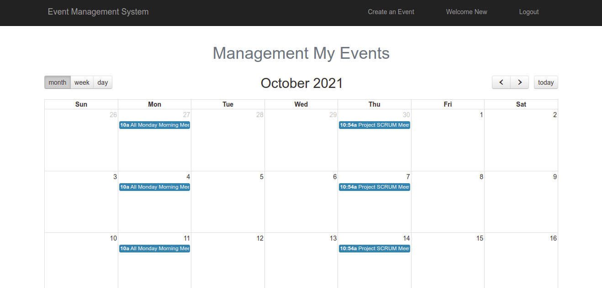

<p align="center"><a href="https://laravel.com" target="_blank"></a></p>


## About Project
- An complete user event managements system handled by each user it self.

## Features 
1. Login 
2. Registration
3. Dashboard
4. Event Creation
5. Calender Event Management and Scheduled Events
6. Logout.
7. New features on the way...


## Tech Stack

- LAMP Stack - Use Laravel Framework, Mysql DB
- Frontend - Bootstrap with Blade Template with Javascript
- Github - for version control

## Installation Process.

### Clone the Repo via this command.
```
git clone https://github.com/vikas-ukani/event-management-system
```

### Install compose packages.
```
composer install
```

### copy .env from .env.example
```
cp .env.example .env
```

### Generate App key.
```
php artisan key:generate
```

### Database Migration 
```
php artisan migrate
```

---
OR
---

### Use Exported Database from `./database/` directory.
### Run Project
```
php artisan serve
```


## SnapShots

